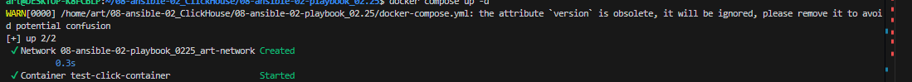
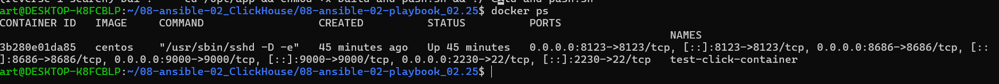
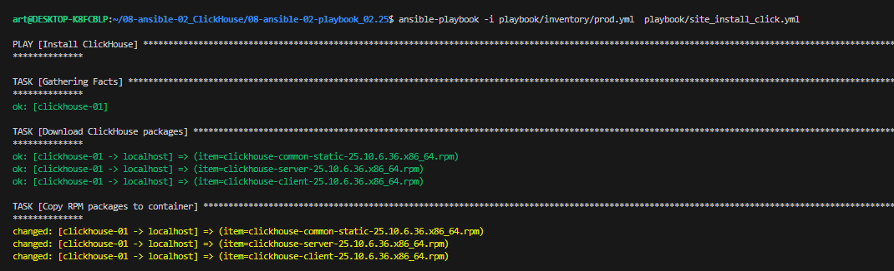
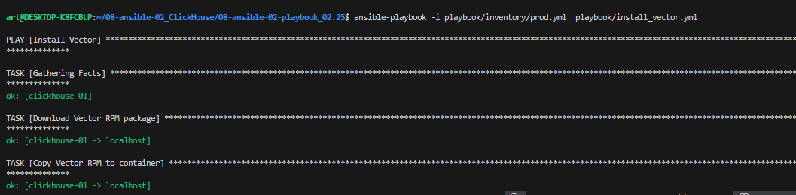
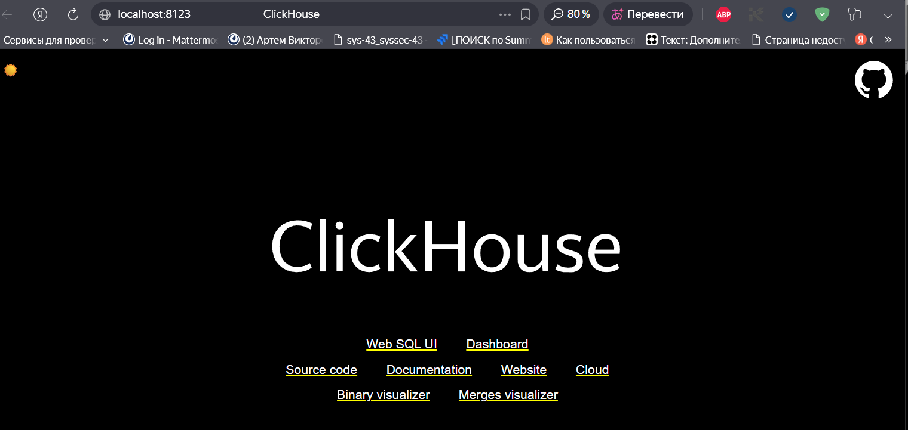
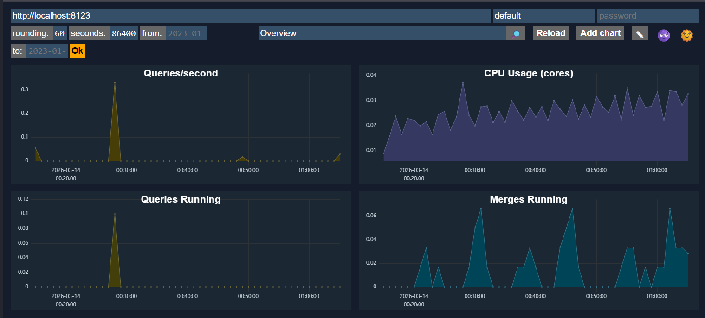
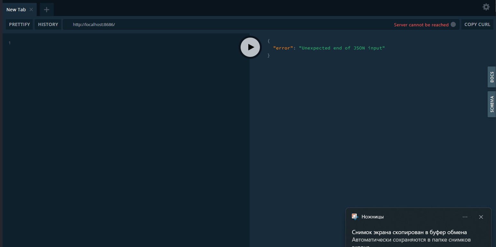
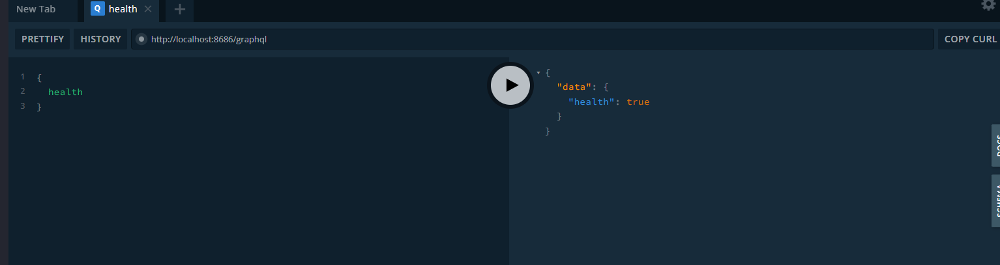
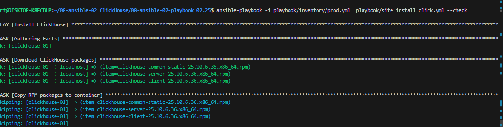
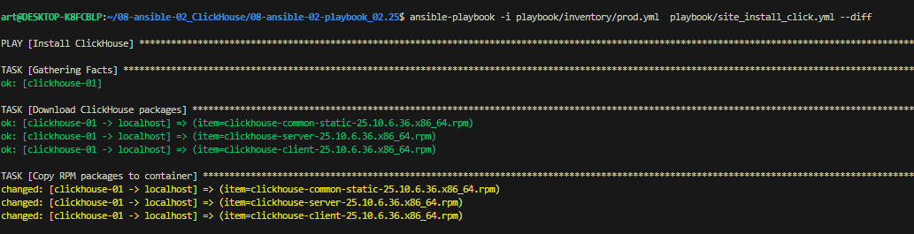

# Домашнее задание к занятию 2 «Работа с Playbook»

## Подготовка к выполнению

1. * Необязательно. Изучите, что такое [ClickHouse](https://www.youtube.com/watch?v=fjTNS2zkeBs) и [Vector](https://www.youtube.com/watch?v=CgEhyffisLY).
2. Создайте свой публичный репозиторий на GitHub с произвольным именем или используйте старый.
3. Скачайте [Playbook](./playbook/) из репозитория с домашним заданием и перенесите его в свой репозиторий.
4. Подготовьте хосты в соответствии с группами из предподготовленного playbook.

## Основная часть

1. Подготовьте свой inventory-файл `prod.yml`.
2. Допишите playbook: нужно сделать ещё один play, который устанавливает и настраивает [vector](https://vector.dev). Конфигурация vector должна деплоиться через template файл jinja2. От вас не требуется использовать все возможности шаблонизатора, просто вставьте стандартный конфиг в template файл. Информация по шаблонам по [ссылке](https://www.dmosk.ru/instruktions.php?object=ansible-nginx-install). не забудьте сделать handler на перезапуск vector в случае изменения конфигурации!
3. При создании tasks рекомендую использовать модули: `get_url`, `template`, `unarchive`, `file`.
4. Tasks должны: скачать дистрибутив нужной версии, выполнить распаковку в выбранную директорию, установить vector.
5. Запустите `ansible-lint site.yml` и исправьте ошибки, если они есть.
6. Попробуйте запустить playbook на этом окружении с флагом `--check`.
7. Запустите playbook на `prod.yml` окружении с флагом `--diff`. Убедитесь, что изменения на системе произведены.
8. Повторно запустите playbook с флагом `--diff` и убедитесь, что playbook идемпотентен.
9. Подготовьте README.md-файл по своему playbook. В нём должно быть описано: что делает playbook, какие у него есть параметры и теги. Пример качественной документации ansible playbook по [ссылке](https://github.com/opensearch-project/ansible-playbook). Так же приложите скриншоты выполнения заданий №5-8
10. Готовый playbook выложите в свой репозиторий, поставьте тег `08-ansible-02-playbook` на фиксирующий коммит, в ответ предоставьте ссылку на него.

---

### Как оформить решение задания

Приложите ссылку на ваше решение в поле "Ссылка на решение" и нажмите "Отправить решение"

---


# РЕШЕНИЕ


Выполним задание в контейнере 
для этого соберем образ
```
FROM quay.io/centos/centos:stream9

# Отключаем интерактивный режим
ENV DEBIAN_FRONTEND=noninteractive

# Устанавливаем необходимые пакеты
RUN dnf update -y && \
    dnf install -y \
        wget \
        curl-minimal \
        net-tools \
        iputils \
        openssh-server \
        sudo \
        && \
    dnf clean all && \
    rm -rf /var/cache/dnf/*

# Создаем директорию для SSH
RUN mkdir /var/run/sshd

# Генерируем хостовые ключи SSH
RUN ssh-keygen -A

# Создаем пользователя art с паролем 123
RUN useradd -m -s /bin/bash art && \
    echo 'art:123' | chpasswd && \
    usermod -aG wheel art

# Настраиваем sudo для группы wheel
RUN echo "%wheel ALL=(ALL) ALL" >> /etc/sudoers

# Настраиваем SSH для авторизации по паролю и ключам
RUN sed -i 's/#PasswordAuthentication yes/PasswordAuthentication yes/' /etc/ssh/sshd_config && \
    sed -i 's/#PermitEmptyPasswords no/PermitEmptyPasswords no/' /etc/ssh/sshd_config && \
    sed -i 's/#PubkeyAuthentication yes/PubkeyAuthentication yes/' /etc/ssh/sshd_config && \
    sed -i 's/#AuthorizedKeysFile/AuthorizedKeysFile/' /etc/ssh/sshd_config

# Создаем директорию для SSH ключей пользователя
RUN mkdir -p /home/art/.ssh && \
    chmod 700 /home/art/.ssh && \
    touch /home/art/.ssh/authorized_keys && \
    chmod 600 /home/art/.ssh/authorized_keys && \
    chown -R art:art /home/art/.ssh

# Открываем порт для SSH
EXPOSE 22 8123 9000

# Запускаем SSH сервер в foreground режиме
CMD ["/usr/sbin/sshd", "-D", "-e"]

RUN dnf install -y nano \
    procps-ng \
    vim \
    && dnf clean all
```
```
docker build -t centos:latest -f Dockerfile_CENTOS .
```
запустим контейнер 
```
docker compose up -d
```

```
docker ps
```


запукаем play для установки clickhouse

```
 ansible-playbook -i playbook/inventory/prod.yml  playbook/site_install_click.yml
```



установим vector

```
ansible-playbook -i playbook/inventory/prod.yml  playbook/install_vector.yml
```




проверяем clickhouse
http://localhost:8123/



проверяем vector

http://localhost:8686/playground






Ключ --check
```
ansible-playbook -i playbook/inventory/prod.yml  playbook/site_install_click.yml --check
```


Ключ --diff


```
 ansible-playbook -i playbook/inventory/prod.yml  playbook/site_install_click.yml --diff
```



## Описание плейбука
```
- name: Download Vector RPM package
```
- Скачивает RPM пакет Vector с официального репозитория
- Сохраняет в директорию ../ относительно папки с плейбуком
- force: no - не перезаписывает, если файл уже существует
- Выполняется на локальной машине

```
- name: Copy Vector RPM to container
```
- Использует docker cp для копирования RPM пакета внутрь контейнера
- Копирует во временную директорию контейнера (/tmp/)
- changed_when: false - не считает это изменение

```
- name: Install Vector package inside container

```


- Выполняет rpm -ivh внутри контейнера для установки пакета

- Особые условия:
- - failed_when: считает успешным, если пакет уже установлен (код 1)
- - changed_when: считает изменением только реальную установку

```
- name: Create Vector config directory inside container
- name: Create Vector data directory inside container

```
- Создает директории для:
- Конфигурации: /etc/vector
- Данных: /var/lib/vector
- Использует mkdir -p для создания всех промежуточных директорий

```
- name: Copy Vector config to container
```

- Копирует файл конфигурации из templates/vector.yml.j2 в контейнер
- Конвертирует Jinja2-шаблон в конечный YML файл
- Триггерит handler restart vector

```
- name: Stop Vector if running
```

- Использует pkill -f vector для остановки процесса
- || true - не завершается ошибкой, если процесс не найден
- ignore_errors: yes - продолжает выполнение при любых ошибках

```
- name: Start Vector service
```

- Запускает Vector с указанием конфигурационного файла
- -d флаг для detach (запуск в фоне)
- Регистрирует результат для отслеживания изменений

### Handlers (обработчики)
```
- name: restart vector
```
- Останавливает процесс Vector (если запущен)
- Вызывается при изменении конфигурации

```
- name: start vector after restart
```

- Запускает Vector после перезапуска
-  Привязан к событию "restart vector" через listen


все операции с контейнерами выполняются через команды docker exec и docker cp

Идемпотентность: учитывает, что пакет может быть уже установлен

Управление конфигурацией: использует шаблоны для гибкой настройки

Graceful restart: корректно перезапускает сервис при изменении конфигурации.